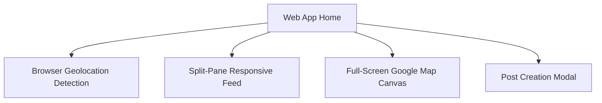

# Neighborhoods: Web-First Technical Blueprint & Tech Stack Specification

This document provides a comprehensive technical blueprint and detailed tech stack specification of the **Neighborhoods** hyper-local social discovery application, redesigned with a **Web-First / Web-Only** implementation priority. It serves as an architectural template for starting and deploying the web application.

---

## 1. Product & Web-First Feature Overview

**Neighborhoods** is a modern, high-engagement web application focusing on hyper-local community interactions. Restructuring as a **Web-First** platform allows immediate browser access, responsive layouts across desktop/mobile viewports, and seamless geolocation integration without app store hurdles.



### Core Web Features

1. **Browser-Based Location Anchor**
   * **W3C Geolocation API Integration**: Utilizes browser geolocation coordinates to anchor users.
   * **Reverse Geocoding**: Automatically translates coordinates to human-readable neighborhood names via light-weight browser requests.
   * **Manual Neighborhood Picker**: Sidebar input for quick neighborhood selection when GPS is disabled.

2. **Split-Screen Map & Feed UI (Desktop Viewport)**
   * **Dynamic Split Layout**: Multi-pane layout showing an interactive Google Map on the left (or right) and a scrollable community feed on the other.
   * **Responsive Design**: Auto-collapses to a single-column layout on mobile web viewports with an easy toggle button between "Feed View" and "Map View".
   * **Visual Hover Interactions**: Hovering over a post card in the feed highlights its respective coordinate marker on the Google Map in real-time.

3. **Google Map Interactive Canvas**
   * **Custom Styled Map**: Tailored Google Maps styling JSON (e.g. premium Teal/Dark-mode aesthetics) matching the app design system.
   * **Dynamic Pins**: Color-coded category markers (Events, Safety, Lost & Found, Free/Sale).
   * **Info Window Previews**: Tapping a marker expands a rich preview card showing post summary, media thumbnails, and quick action links.

---

## 2. Web-First Technology Stack

```
┌────────────────────────────────────────────────────────┐
│                      Web Client                        │
│   React Native Web + Expo (54) + TypeScript + Metro    │
└───────┬──────────────────────┬──────────────────┬──────┘
        │ State & Sync         │ Mapping Engine   │ Styling System
        ▼                      ▼                  ▼
┌──────────────┐       ┌──────────────┐   ┌──────────────┐
│   Zustand    │       │ React Google │   │ CSS Modules  │
│  & React     │       │   Maps API   │   │  & Premium   │
│   Query      │       │   (Web-Only) │   │ HSL Tokens   │
└──────────────┘       └──────────────┘   └──────────────┘
```

### Web-First Dependencies

| Layer | Dependency | Purpose |
| :--- | :--- | :--- |
| **Framework** | `react-native-web` | Translates React Native primitives (`View`, `Text`, `Pressable`) into high-performance semantic HTML tags (`div`, `span`, `button`). |
| **Maps (Web)** | `react-leaflet` + `leaflet` | Open-source mapping library with OpenStreetMap tiles, no API key required, fully customizable. |
| **Bundler** | `Metro (Web)` | Expo's highly optimized, fast-refresh bundler configured to output optimized static HTML/JS bundles. |
| **State** | `Zustand` & `React Query` | Handles global responsive states, coordinates caching, and asynchronous web requests to BaaS. |

---

## 3. Web Leaflet Integration Architecture

To integrate Leaflet + OpenStreetMap on web, use a unified container that handles map loading, custom styling, and marker synchronization:

### Leaflet Web Component Blueprint

```typescript
import React, { useState } from 'react';
import { MapContainer, TileLayer, Marker, Popup } from 'react-leaflet';
import 'leaflet/dist/leaflet.css';
import L from 'leaflet';
import Colors from '@/constants/Colors';

const mapContainerStyle = {
  width: '100%',
  height: '100%',
  borderRadius: '16px',
};

// Custom marker icons for each category
const createMarkerIcon = (category: string) => {
  const color = category === 'event' ? Colors.event :
                category === 'safety' ? Colors.safety :
                category === 'sale' ? Colors.sale : Colors.general;
  
  return L.divIcon({
    html: `<div style="background-color: ${color}; width: 20px; height: 20px; border-radius: 50%; border: 2px solid white; box-shadow: 0 0 8px ${color}80;"></div>`,
    iconSize: [24, 24],
    className: 'custom-marker'
  });
};

interface MapProps {
  center: { lat: number; lng: number };
  posts: Array<{ id: string; title: string; lat: number; lng: number; category: string }>;
}

export const NeighborhoodsMap: React.FC<MapProps> = ({ center, posts }) => {
  const [activeMarker, setActiveMarker] = useState<string | null>(null);

  return (
    <MapContainer
      center={[center.lat, center.lng]}
      zoom={14}
      style={mapContainerStyle}
      className="neighborhoods-map"
    >
      <TileLayer
        attribution='&copy; <a href="https://www.openstreetmap.org/copyright">OpenStreetMap</a> contributors'
        url="https://{s}.tile.openstreetmap.org/{z}/{x}/{y}.png"
      />
      {posts.map((post) => (
        <Marker
          key={post.id}
          position={[post.lat, post.lng]}
          icon={createMarkerIcon(post.category)}
          eventHandlers={{
            click: () => setActiveMarker(post.id),
          }}
        >
          {activeMarker === post.id && (
            <Popup>
              <strong>{post.title}</strong>
              <br />
              {post.category}
            </Popup>
          )}
        </Marker>
      ))}
    </MapContainer>
  );
};
```

---

## 4. Web Development Playbook

To kickstart and build the project in **web-first** mode, run the following:

1. **Install Web Dependencies**:
   ```bash
   npm install @react-google-maps/api react-native-web react-dom
   ```
2. **Start Web Dev Server**:
   ```bash
   npx expo start --web
   ```
3. **Configure Environment Variables**:
   Create a `.env` file in the root directory:
   ```env
   EXPO_PUBLIC_SUPABASE_URL=your_supabase_url
   EXPO_PUBLIC_SUPABASE_ANON_KEY=your_supabase_anon_key
   # No map API key needed for Leaflet + OpenStreetMap
   ```
4. **Compile Production Bundle**:
   To generate optimized web-only bundles:
   ```bash
   npx expo export --platform web
   ```
